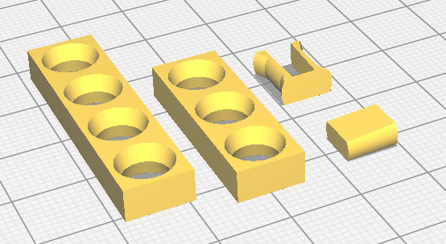

# Clip and block

Clip & block est un projet pour vos montages électroniques à partir d'Arduino et de composants populaires autour d'Arduino. Il permet d'imprimer des support avec une imprimante 3D pour vos montages.

Image d'exemple

## Démarrer avec Clip & block en une heure

### Imprimer vos premier Clip & block
J'ai concu Clip & blocks pour que ce soit simple à imprimer (Pas de support, possibilité de l'imprimer dans tous les sens, pas trop de précision nécessaire).
Le principe et d'imprimer des plaques de base, de les assembler avec des clips et de bloquer ces clips avec des bloqueurs.

Pour commencer, vous aller imprimer vos premières plaques, clips et bloqueurs : 

#### Pour les plaques
- aller dans le répertoire [basic](https://gitlab.com/tedour/clip-and-block/-/tree/master/stl/basic),
- imprimer une plaque [I-3.stl](https://gitlab.com/tedour/clip-and-block/-/blob/master/stl/basic/I-3.stl),
- imprimer une plaque [I-4.stl](https://gitlab.com/tedour/clip-and-block/-/blob/master/stl/basic/I-4.stl).

> I-2.stl => La lettre I désigne la forme de la plaque, le chiffre 2 indique le nombre de trous

#### Pour le clip et bloqueur
- aller dans le répertoire [clips](https://gitlab.com/tedour/clip-and-block/-/tree/master/stl/clips),
- imprimer un [blocker-2.stl](https://gitlab.com/tedour/clip-and-block/-/blob/master/stl/clips/blocker-2.stl) (de préférence, le mettre à plat, cela se fait très bien avec Cura),
- imprimer un [clip-2.stl]() (comme pour le bloqueur, le mettre à plat, en le tournant à 90°).

> Le blocker-2.stl va fonctionner avec le clip-2.stl. Le chiffre 2 indique la hauteur du clip (2 trous)

Notez qu'il ne faut pas beaucoup de plastique pour ces plaques de base (2g et 0.83m avec mes réglages pour ces 4 pièces). Après plusieurs essais, je suis parti sur une taille, pour un trou de 9.6mm x 9.6mm x 4.8mm. Plus petit, les manipulations deviennent difficiles.

Vous pouvez maintenant assembler ces pièces !

> Pour démonter, il faut pousser le bloqueur par l'aute côté à l'aide d'un petit outil pointu

> Si vous imprimez un deuxième clip et un deuxième bloqueur, vous pouvez aprécier la solidité du montage !

## Les différentes plaques

Dans le répertoire Basic

Exemples :

*Faire un tableau*