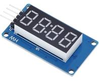
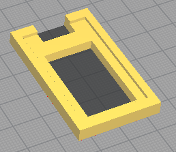
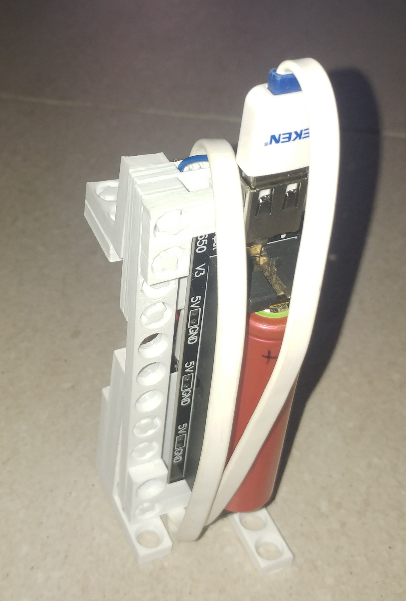

> Ce document a été réalisé pour un journal sur [linuxfr](https://www.linuxfr.org)

# Clip and block
Clip & block permet de créer des structures solides avec une imprimante 3D pour les projets électroniques basés sur Arduino.
Vous avez à votre disposition des plaques qu'il est possible d'assembler et de démonter facilement pour ajouter et retirer différents composants.

> Vous pouvez aller voir à la fin de cette dépèche pour visualiser quelques exemples de réalisation.

## Démarrer avec Clip & block en une heure

### Imprimer vos premier Clip & block
J'ai concu Clip & blocks pour que ce soit simple à imprimer (Pas de support, possibilité de l'imprimer dans tous les sens, pas trop de précision nécessaire car les formes sont simples).

Vous pouvez cloner le projet sur [Gitlab](https://gitlab.com/tedour/clip-and-block/)

Pour commencer, vous aller imprimer vos deux premières plaques, clips et bloqueurs : 

#### Pour les plaques
- aller dans le répertoire [basic](https://gitlab.com/tedour/clip-and-block/-/tree/master/stl/basic),
- récupérer une plaque [I-3.stl](https://gitlab.com/tedour/clip-and-block/-/blob/master/stl/basic/I-3.stl),
- récupérer une plaque [I-4.stl](https://gitlab.com/tedour/clip-and-block/-/blob/master/stl/basic/I-4.stl).

> I-3.stl => La lettre I désigne la forme de la plaque, le chiffre 3 indique le nombre de trous

#### Pour le clip et bloqueur
- aller dans le répertoire [clips](https://gitlab.com/tedour/clip-and-block/-/tree/master/stl/clips),
- récupérer un [blocker-2.stl](https://gitlab.com/tedour/clip-and-block/-/blob/master/stl/clips/blocker-2.stl) (de préférence, le mettre à plat, cela se fait très bien avec Cura),
- récupérer un [clip-2.stl]() (comme pour le bloqueur, le mettre à plat, en le tournant à 90°).

> Le chiffre 2 indique la hauteur du clip (2 trous). Le blocker-2.stl va fonctionner avec le clip-2.stl. 

Notez qu'il ne faut pas beaucoup de plastique pour ces plaques de base (2g et 0.83m avec mes réglages pour ces 4 pièces). Après plusieurs essais, je suis parti sur une taille, pour un trou de 9.6mm x 9.6mm x 4.8mm. Plus petit, les manipulations deviennent difficiles (mais peut-être qu'il faudrait que je teste à nouveau en 6.4mm x 6.4mm x 3.2mm).

Vous pouvez maintenant assembler ces pièces !

> Pour démonter, il faut pousser le bloqueur par l'aute côté à l'aide d'un petit outil pointu

> Si vous imprimez un deuxième clip et un deuxième bloqueur, vous pouvez aprécier la solidité du montage !

## Les différentes plaques

### Plaques existantes
Dans le répertoire Basic vous trouverez un grand nombres de plaques prédéfinies (75 à ce jour). Ils sont classés en fonction de leur forme et du nombre de trous qu'ils comportent (en une, deux ou trois dimensions).
Pour s'y retrouver, voici quelques exemples :

|     Nom |         Image          | Description                                                  |
| ------: | :--------------------: | :----------------------------------------------------------- |
|     I-3 |      | I => En long   3 trous en longueur                       |
|  LF-3-2 |  | LF => En L à plat   3 en longueur, 2 de l'autre côté     |
| L-2-1-1 |  | L => En L  2 en longueur, 1 en hauteur, 1 en largeur     |
| L-2-1-1 |  | L => En L  2 en longueur, 2 en hauteur, 3 en largeur     |
| U-2-2-2 |  | U => En U                                                |
|   P-2-2 |    | P => Plaque à plat                                       |
| C-2-2-1 |  | C => Cube  2 en longueur, 2 en hauteur, 1 en largeur     |
|    IR-3 |     | IR => En long, bouts arrondis, (pour des pièces en rotation) |
|    IH-3 |     | IH => En long, demi hauteur                                  |
|   IHR-3 |    | IH => En long, demi hauteur, bouts arrondis                  |

> Il y a certaines redondances (C et P par exemple), il faudrait que je fasse le ménage...

### Créer ses plaques sur mesure

Si vous ne trouvez pas votre bonheur dans ces fichiers STL, il est possible de créer, avec [openscad](https://www.openscad.org/), vos propres plaques assez simplement.

Voici par exemple comment créer une plaque P-2-3 (Plaque à plat en 2x3).
- Ouvrez le fichier [clip_and_block.scad](https://gitlab.com/tedour/clip-and-block/-/blob/master/clip_and_block.scad)
- Modifiez le paramètre **model** pour le type de plaque à **P**
- Modifiez le paramètre **length1** pour la longueur à **2**
- Modifiez le paramètre **length2** pour la largeur à **3**
- Vous pouvez ensuite faire un rendu avec la touche **F6**
- Et exporter en STL depuis OpenSCAD

### Le fichier list-plates.txt et le script generate-plates.py
Pour automatiser la génération des fichiers STL, j'ai créé le fichier *list-plates.txt* qui liste toutes les plaques. 

Le fichier *generate-plates.py* lit ce fichier et lance les commandes OpenSCAD avec les paramètres qui vont bien.

## Les plaques pour composants électroniques
C'est ici la partie intéressante du projet : pouvoir intégrer des composants electroniques dans vos montages.

### Les composants pris en charge
Comme pour les plaques, j'ai créé un certain nombre de plaques qui permettent d'inclure des composants. Ils se trouvent dans le répertoir [stl/electronic](https://gitlab.com/tedour/clip-and-block/-/blob/master/stl/electronic).

Voici par exemple les deux plaques qui permettent d'inclure un [NodeMCU](https://fr.wikipedia.org/wiki/NodeMCU) (J'utilise beaucoup cette carte) :

Il existe bien d'autres variantes de ces plaques, avec plus ou moins de trous, des trous d'un seul côté, etc.

Voici la liste des composants présents dans clip & blocks, cette liste pourra (assez) facilement être étendue :

|  Nom | Image | Description |
| ---: | :----: | :-----------|
|18650x2 Batterie holder |  | Alimentation 7.4v |
|18650 Batterie shield V3 |  | Alimentation USB + 3.3V + 5V + Recharge |
| BME 280 |  | Température + Pression |
| Breadboard 25 trous |  | Connexion |
| Button 14x20 |  | Boutton |
| D1 Mini |  | Carte développement |
| DC Motor with gearbox |  | Moteur démultiplié |
| L9110s Driver motor |  | Driver moteur DC
| NodeMCU |  | Carte développement |
| Oled 128x64 |  | Afficheur OLED |
| SG90 (Une seule variante, à améliorer) |  | Servo moteur |
| Simple switch |  | interrupteur
| Afficheur TM1637 |  | Afficheur 4x7 segments |

> Il existe plusieurs variantes pour chaque composant, je vous laisse les découvrir.

### Créer ses plaques pour ses composants
Vous pouvez créer vos propres plaques pour vos composants. Pour cela, vous devez modéliser une pièce autour de votre composant avec votre modeleur préféré.
Pour pouvoir ajouter des trous Clip & Block autour, il faut veiller à ce que leur longueur et leur largeur soient un multiple de 9.6mm et leur hauteur de 4.8mm.

Vous pouvez ensuite ajouter des trous grâce à OpenSCAD.

#### Créer son .stl pour son composant

Voici par exemple comment j'ai procédé pour l'afficheur TM1637 :
- Pris en compte des dimenssions de l'afficheur
- Création d'une "boîte" autour du composant qui est un multiple de 9.6 (Ici, 48mm - 5 trous x 28.8mm - 3 trous x 4.8mm)

Dessous :

Dessus :

#### Ajouter les trous avec openscad

Ensuite, il est possible d'ajouter les trous autour de votre montage grâce à OpenSCAD :
- Ouvrez le fichier [clip_and_block.scad](https://gitlab.com/tedour/clip-and-block/-/blob/master/clip_and_block.scad)
- Déposez votre fichier STL dans le dossier [import](https://gitlab.com/tedour/clip-and-block/-/blob/master/import)
- Modifiez le paramètre **model** pour le type de plaque à **F** (Filename). Pour des trous de demi hauteur, choisissez **FH**.
- Dans le tableau **holeArray**, entrez les coordonées de vos trous (Il faut tester pour trouver les bons)
- Dans le tableau **finalRotate** vous pouvez tourner votre model final pour qu'il soit à plat
- Dans le tableau **finalMirror** vous pouvez faire un flip de votre modèle

#### Utiliser le fichier list-elec.csv le script generate-elec.py
Comme pour les plaques, j'ai automatisé la génération des fichiers STL. K'ai créé le fichier *list-elec.csv* qui liste toutes les plaques pour composants. 

Vous pouvez voir que dans ce fichier, vous pouvez indiquer toutes les options. Je vais peut-être le fusionner avec le fichier *list-plates.txt*.

Le fichier *generate-plates.py* lit ce fichier et lance la commande OpenSCAD avec les paramètres.

> Je vais peut-être fusionner les fichiers list-plates.txt et list-elec.csv prochainement.

## Mes réalisations

Voici ce que j'ai réalisé avec les clip and blocks, je pourrais, si vous le demandez, détailler ces projets :

- [Virtual Wall Roomba](https://www.thingiverse.com/thing:3413412) (Mur virtuel pour aspirateur automatique)

- [Sablier électronique](https://www.thingiverse.com/thing:3413412) (Pour ne pas avoir à rapeller l'heure le matin à mes enfants :))

- Micro tracteur télécommandé (Basé sur le projet [FF RC-Car](https://www.thingiverse.com/thing:3133996))

Ces projets fonctionnent plutôt bien, et je m'en sers régulièrement. Voici pour moi les qualités et les défauts de Clip & blocks :

Qualités :
- Solidité 
- Facile de faire des modifications
- Pas besoin de réimprimer l'ensemble pour les modifications

Défaults :
- Manque de plaques esthétiques (caches, couvercles, etc)
- Sécurisation des connecteurs Dupont par des plaques
- Organisation des fils

## La suite ?
J'ai un petit peu abandonné ce projet depuis quelques mois, suite à une charge de travail importante.
Cependant, je trouve dommage de le laisser à l'abandon, c'est pourquoi je vous demande de l'aide. Alors, de quoi ai-je besoin ?

### Tester
La première chose que j'aimerais savoir c'est si ce projet fonctionne chez vous, si cela peut répondre à un besoin (ou le créer ?). Donc, merci de tester et de suivre la première partie de ce tutoriel !

### Quelques idées d'évolutions
- Ajouter des composants (selon vos besoins)
- Sécuriser les connecteurs / créer passe fils
- Créer des plaques *décoratives*
- Faire des manuels avec [ldcad](http://www.melkert.net/LDCad)
- Créer d'autres projets ?

### Créer une communauté
Jusqu'à maintenant, je n'ai que mon [GitLab](https://gitlab.com/tedour/clip-and-block). Mais je viens de créer un compte Mastodon pour discuter / échanger.

